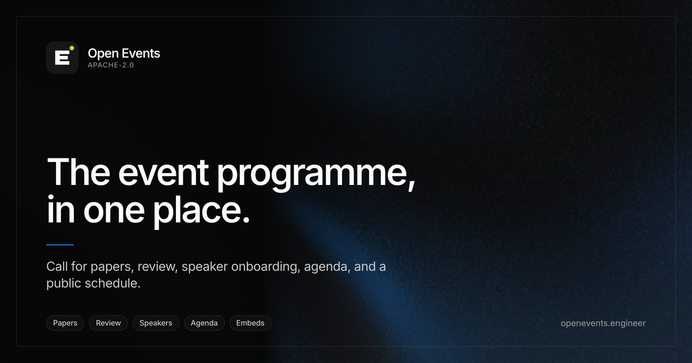
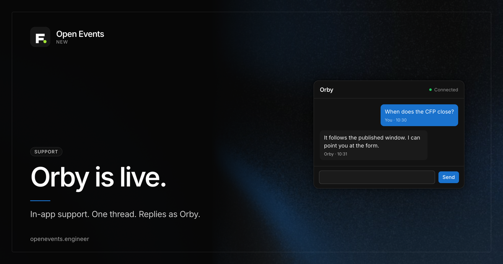

# Open Events



Open Events is an open-source platform for running an event programme. Organizers publish a call for papers, speakers submit and revise proposals, a review committee scores them, accepted speakers onboard, and the public gets a schedule they can star and export.

**Live demo:** [openevents.engineer](https://openevents.engineer)

The public call for papers and programme are open to anyone. Organizer, speaker, and reviewer surfaces need a sign-in.

This repository is one pnpm package and one deployable: a React app and a Hono API on the same Cloudflare Worker. Strict TypeScript. Apache-2.0.

## Contents

- [What it does](#what-it-does)
- [Who uses it](#who-uses-it)
- [Live demo](#live-demo)
- [Tech stack](#tech-stack)
- [Architecture](#architecture)
- [Prerequisites](#prerequisites)
- [Getting started](#getting-started)
- [Environment](#environment)
- [Scripts](#scripts)
- [Testing](#testing)
- [Keyboard](#keyboard)
- [Deploying](#deploying)
- [Social image](#social-image)
- [Troubleshooting](#troubleshooting)
- [Contributing](#contributing)
- [License](#license)

## What it does

- **Call for papers.** An organizer builds the form (typed questions, choices from the event's own vocabulary, conditional questions and routing), publishes a version, and sets the window that opens and closes submissions.
- **Proposals.** Speakers submit with co-speakers, save drafts that survive signing in, and revise what they sent while the call is open.
- **Review.** Committee rounds with their own scorecards (ratings, choices, free text), per-round reviewer pools, blind review, conflict-of-interest recusal, one-action distribution of the reading, and weighted results.
- **Decisions and onboarding.** Accept or reject, with every surface honouring the verdict. Accepted speakers get a portal checklist: profile, headshot, files, travel, tasks.
- **Programme.** An agenda board with room, track, and speaker conflict detection, assisted placement, and a published public schedule.
- **Public site.** Schedule, session list, speaker gallery and speaker pages, personal itinerary with starred sessions, and iCal.
- **Embeds.** Snippets and feeds for sessions, speakers, the agenda, the itinerary, or the gallery (HTML, JSON, XML, or iCal).
- **Organizer desk.** Speaker roster (add, CSV, mail), a list-and-peek submissions desk, a files library with a version trail, and a log of every message the event has sent.
- **Orby.** A floating support widget on the public site. One conversation per person, stored in D1. Orby answers through OpenRouter (`openai/gpt-5.6-luna`) when `OPENROUTER_API_KEY` is set; organizers can still take over from **Orby** in the rail. If a reply sits unread for five minutes, the existing mail adapter sends a reminder (capture-only unless Resend is configured). The widget polls; this Worker does not open a WebSocket.



## Who uses it

| Role                | How they get in                             | Where they work                                                    |
| ------------------- | ------------------------------------------- | ------------------------------------------------------------------ |
| Organizer           | Shared admin token, or optional Clerk OAuth | `/admin`                                                           |
| Speaker / submitter | Magic link from `/start`                    | `/cfp/...`, `/portal`, `/headshot`                                 |
| Reviewer            | Magic link after assignment                 | `/evaluations`                                                     |
| Public              | No account                                  | `/`, `/cfp/...`, `/schedule/...`, `/sessions/...`, `/speakers/...` |

Email is capture-only unless Resend is configured. In that mode the **Messages** desk still holds every outbound body, including sign-in links.

## Live demo

The hosted event is [DemoConf 2026](https://openevents.engineer):

| Surface            | URL                                                                             |
| ------------------ | ------------------------------------------------------------------------------- |
| Front door         | [openevents.engineer](https://openevents.engineer)                              |
| Call for papers    | [/cfp/demo-conf-2026/cfp](https://openevents.engineer/cfp/demo-conf-2026/cfp)   |
| Schedule           | [/schedule/demo-conf-2026](https://openevents.engineer/schedule/demo-conf-2026) |
| Sessions           | [/sessions/demo-conf-2026](https://openevents.engineer/sessions/demo-conf-2026) |
| Speakers           | [/speakers/demo-conf-2026](https://openevents.engineer/speakers/demo-conf-2026) |
| Organizer          | [/admin](https://openevents.engineer/admin)                                     |
| Start (magic link) | [/start](https://openevents.engineer/start)                                     |

Health: [`GET /api/health`](https://openevents.engineer/api/health) returns `{ status, build, database }` only.

## Tech stack

- **Language:** TypeScript 5.9, Node `>=22.14.0` (pinned `22.14.0` in `.nvmrc`)
- **App:** React 19, Vite 8, TanStack Router (file routes, automatic code splitting)
- **Data on the client:** TanStack Query, React Hook Form, Zod
- **UI:** Tailwind CSS 4, shadcn/ui on `@base-ui/react` only, Inter Variable, dnd-kit
- **API:** Hono on Cloudflare Workers, same-origin `/api`
- **Data:** Drizzle ORM, Cloudflare D1 (SQLite, foreign keys on), Cloudflare R2 for validated private files
- **Auth:** Organizer session (local token and optional Clerk). Speaker and reviewer magic links. No speaker OAuth.
- **Email:** Capture adapter by default. Optional Resend.
- **Tests:** Vitest (unit + Workers pool), Playwright (smoke, golden, live)
- **Deploy:** Cloudflare Workers Static Assets + D1 + R2

The UI kit lock is enforced by `pnpm ui:check`. Radix, React Aria, MUI, Chakra, and Mantine are not used.

## Architecture

### Request path

```
Browser
  Vite / TanStack Router pages in src/app/routes
  TanStack Query in src/app/queries
        |
        | same-origin /api
        v
Cloudflare Worker (src/server/index.ts, Hono)
  auth, CSRF origin allowlist, env
  application services (src/application/services)
  ports (src/application/ports)
        |
        +--> D1 via Drizzle (src/db)
        +--> R2 (headshots, documents)
        +--> email sender (capture or Resend)
        +--> Clerk JWKS (organizer OAuth, optional)
```

### Directory map

```
src/
  app/            Routes, feature screens, query functions, command menu
  application/    Services, DTOs, ports, token policy
  domain/         Types and invariants (time, forms, submissions, agenda)
  db/             Drizzle schema, repositories, seed SQL
  server/         Hono app, auth, email, Worker routes
  components/ui/  shadcn / Base UI primitives
  lib/            Theme and shared client helpers
migrations/       D1 SQL migrations (runtime source of truth)
public/           Favicon, social image, still washes
scripts/          db reset, quality checks, OG card renderer
e2e/              Playwright smoke and golden journeys
tests/            Vitest unit + Workers-pool integration
docs/             Public decision records and the release checklist
```

### Layers

The Worker never talks to the database from a route handler through ad-hoc SQL. Routes resolve a container (`src/server/container.ts`), call an application service, and return a DTO. Repositories in `src/db` implement the ports. Domain modules own the CHECKs that migrations also enforce.

UTC instants are ISO-8601 text. Event-scoped parents use composite `(event_id, id)` keys so children can take composite foreign keys.

### Auth

- **Organizer.** `POST /api/admin/login` with `LOCAL_ADMIN_TOKEN`, or Clerk when both publishable and secret keys are set. Session cookie, 2 hours by default.
- **Speaker / reviewer.** `POST /api/public/start` with an email. The handler always returns 202 and never echoes a token. The magic link is written to the captured-message log (and delivered if Resend is configured). Session cookie, 8 hours by default. The raw token lives 24 hours.
- **CSRF.** Cookie-authenticated writes need an `Origin` (or `Referer`) on `ALLOWED_ORIGINS`. An empty allowlist rejects every mutation.

### Email

Development and the test suite never send real mail. `capturingEmailSender` records the message and delivers nothing. Production stays on that adapter until both `RESEND_API_KEY` and `EMAIL_FROM` are set. A failed Resend call is swallowed on purpose: the submission or invite already succeeded, and **Messages** still holds the body.

### Local-only inbox

`GET /api/dev/captured?email=` returns captured mail. It answers 404 unless `LOCAL_DEV_MODE=true` **and** the request host is `localhost` / `127.0.0.1`. A deployed Worker never serves it.

## Prerequisites

- Node.js 22.14.0 (see `.nvmrc`; `engines` requires `>=22.14.0`)
- pnpm 11.17.0, pinned in `packageManager`

```bash
corepack enable
pnpm --version   # 11.17.0
```

A Cloudflare account is only required for a remote deploy. Local D1 and R2 run through Wrangler with no cloud credentials.

## Getting started

```bash
git clone https://github.com/MoizIbnYousaf/open-events.git
cd open-events
pnpm install --frozen-lockfile
cp .dev.vars.example .dev.vars
```

Edit `.dev.vars`. Pick any local-only organizer token and keep `LOCAL_DEV_MODE=true`. Vite serves the app at `http://localhost:5173`, so set the CSRF allowlist to that origin (the fallback when the variable is unset is `http://localhost:8787`, which is not the Vite port):

```
LOCAL_ADMIN_TOKEN=local-dev
LOCAL_DEV_MODE=true
ALLOWED_ORIGINS=http://localhost:5173,http://127.0.0.1:5173
```

Optional Clerk organizer OAuth:

```bash
cp .env.example .env.local
# set VITE_CLERK_PUBLISHABLE_KEY, CLERK_PUBLISHABLE_KEY, CLERK_SECRET_KEY
```

Seed and run:

```bash
pnpm db:reset              # wipe local D1, apply migrations, seed DemoConf 2026
pnpm db:reset:programme    # same, plus a published six-session programme
pnpm dev                   # Vite + Worker under /api
```

Open [http://localhost:5173](http://localhost:5173).

- `pnpm db:reset` is the minimal fixture: one call for papers, no proposals, empty programme. A large part of the suite asserts that shape exactly.
- `pnpm db:reset:programme` layers six accepted sessions across two days, two rooms, and three tracks. The public schedule needs this layer or it has nothing to show.

After changing `wrangler.jsonc`:

```bash
pnpm types:generate
```

## Environment

Values in `.dev.vars` (Wrangler) and `.env.local` (Vite). Never commit either file. `.dev.vars*` and `*.env*` are gitignored; the `.example` files are the allowlisted templates.

### Worker (`.dev.vars` / `wrangler secret`)

| Variable                   | Required                  | Default                                                                                                                      | What it does                                                             |
| -------------------------- | ------------------------- | ---------------------------------------------------------------------------------------------------------------------------- | ------------------------------------------------------------------------ |
| `LOCAL_ADMIN_TOKEN`        | For organizer login       | empty (login cannot succeed)                                                                                                 | Shared organizer secret                                                  |
| `LOCAL_DEV_MODE`           | No                        | `false` in `wrangler.jsonc`                                                                                                  | Enables the localhost captured-mail route                                |
| `ALLOWED_ORIGINS`          | For any cookie write      | local fallback `http://localhost:8787` and `http://127.0.0.1:8787` only when `LOCAL_DEV_MODE=true` and the variable is unset | CSRF allowlist, comma-separated. An explicit empty value allows nothing. |
| `ORGANIZER_SESSION_TTL_MS` | No                        | `7200000` (2h)                                                                                                               | Organizer session lifetime                                               |
| `SUBMITTER_SESSION_TTL_MS` | No                        | `28800000` (8h)                                                                                                              | Speaker / reviewer session lifetime                                      |
| `SUBMITTER_TOKEN_TTL_MS`   | No                        | `86400000` (24h)                                                                                                             | Magic-link token lifetime                                                |
| `RESEND_API_KEY`           | For live mail             | unset (capture only)                                                                                                         | Resend API key                                                           |
| `EMAIL_FROM`               | With the Resend key       | unset                                                                                                                        | From address on a domain you verified                                    |
| `CLERK_PUBLISHABLE_KEY`    | For Clerk organizer login | unset                                                                                                                        | Locates the Clerk JWKS                                                   |
| `CLERK_SECRET_KEY`         | For Clerk organizer login | unset                                                                                                                        | Verifies Clerk session JWTs                                              |

Bindings come from `wrangler.jsonc`: D1 `DB` (`open-events-production`) and R2 `FILES` (`open-events-production-files`).

### Vite (`.env.local`)

| Variable                     | Required         | What it does                                                   |
| ---------------------------- | ---------------- | -------------------------------------------------------------- |
| `VITE_CLERK_PUBLISHABLE_KEY` | For the Clerk UI | Build-time publishable key. Speaker magic links do not use it. |

## Scripts

| Command                             | What it does                                                    |
| ----------------------------------- | --------------------------------------------------------------- |
| `pnpm dev`                          | Vite dev server; Worker API under `/api`                        |
| `pnpm build`                        | `tsc -b` and a production Vite build                            |
| `pnpm preview`                      | Serve the production build locally                              |
| `pnpm db:reset`                     | Wipe local D1, migrate, seed DemoConf 2026                      |
| `pnpm db:reset:programme`           | Same, plus the published programme layer                        |
| `pnpm types:generate`               | Regenerate Worker binding types                                 |
| `pnpm format` / `pnpm format:check` | Prettier                                                        |
| `pnpm lint`                         | ESLint, zero warnings                                           |
| `pnpm typecheck`                    | `tsc` strict (app, tests, e2e)                                  |
| `pnpm test`                         | Vitest: unit + Workers-pool integration                         |
| `pnpm e2e`                          | Playwright smoke (no local secrets)                             |
| `pnpm e2e:golden`                   | Playwright organizer journeys (`LOCAL_ADMIN_TOKEN` required)    |
| `pnpm e2e:live`                     | Golden journeys against production (mutates the live event)     |
| `pnpm ui:check`                     | shadcn Base UI pin; no foreign UI kits                          |
| `pnpm notices:check`                | LICENSE + third-party provenance                                |
| `pnpm perf:check`                   | Per-route and entry-closure size budgets                        |
| `pnpm og:render`                    | Rebuild `public/og/open-events.png` from `scripts/og/card.html` |
| `pnpm clean`                        | Remove local build artifacts                                    |

## Testing

Run every gate before a contribution. The release checklist in [docs/acceptance.md](docs/acceptance.md) is the full list.

```bash
pnpm format:check
pnpm lint
pnpm typecheck
pnpm test
pnpm build
pnpm ui:check
pnpm notices:check
pnpm e2e
LOCAL_ADMIN_TOKEN=local-test pnpm e2e:golden
```

`pnpm e2e` needs no secrets. It resets and seeds the local database, then starts its own dev server on port 4173. If something is already listening there, it reuses that server and leaves the database alone.

`pnpm e2e:golden` signs in as an organizer. It writes the token into a local `.dev.vars` for the run and restores whatever file was there when it finishes.

`pnpm e2e:live` hits the deployed Worker, D1, and R2. It mutates the configured production event. Use it only against a dataset reserved for acceptance.

```
tests/unit/           jsdom unit tests
tests/integration/    Workers-pool API tests against real D1
e2e/                  Playwright smoke + golden + live
```

## Keyboard

| Chord                          | Does                                  |
| ------------------------------ | ------------------------------------- |
| `Cmd+K` / `Ctrl+K`             | Open or close the command menu        |
| `Cmd+Shift+D` / `Ctrl+Shift+D` | Cycle the theme: System, Light, Dark  |
| `Cmd+Shift+L` / `Ctrl+Shift+L` | Cycle the theme (compatibility alias) |

Inside the command menu: type to filter, `↑`/`↓` and `Home`/`End` to move, `Enter` to go, `Escape` to close. Focus returns to the button that opened it, and the search box is empty every time it opens.

Neither chord fires while you are typing in a text box, a text area, a select, or a rich-text field. Native text editing always wins, including `Ctrl+K`, which deletes to the end of the line in macOS text controls.

The primary theme chord is `D`. `L` stays as an alias. `Cmd/Ctrl+Shift+D` overlaps browser commands, which remain available from browser menus. See [docs/decisions.md](docs/decisions.md) DEC-015.

Theme preference is stored as `open-events.theme` (`system` / `light` / `dark`). Dark is the default interaction surface. System follows the OS.

## Deploying

Open Events runs on Cloudflare Workers with D1 and R2. From a Cloudflare account with Wrangler authenticated:

```bash
npx wrangler d1 create <your-database>
npx wrangler r2 bucket create <your-bucket>
# put both names into wrangler.jsonc, then:
npx wrangler d1 migrations apply <your-database> --remote
npx wrangler d1 execute <your-database> --remote --file src/db/seed.sql
# optional published programme:
npx wrangler d1 execute <your-database> --remote --file src/db/seed-programme.sql
npx wrangler deploy
```

Set `ALLOWED_ORIGINS` in `wrangler.jsonc` to the origin you deploy to. A mismatch refuses every authenticated write as cross-origin. Then set the organizer secret:

```bash
npx wrangler secret put LOCAL_ADMIN_TOKEN
```

This repository's Worker is `open-events`. Production routes are `openevents.engineer` and `www.openevents.engineer`.

### Clerk (optional)

Organizer OAuth is optional Clerk. Speaker magic links stay on `/start` and do not use Clerk. To turn Clerk on, set `VITE_CLERK_PUBLISHABLE_KEY` at build time and:

```bash
npx wrangler secret put CLERK_PUBLISHABLE_KEY
npx wrangler secret put CLERK_SECRET_KEY
```

Add the production origin to the Clerk instance's allowed origins.

### Email

```bash
npx wrangler secret put RESEND_API_KEY
npx wrangler secret put EMAIL_FROM     # must be on a domain you have verified
```

With no provider configured, organizers still read every message (including speaker and reviewer sign-in links) from **Messages**.

## Social image

The Open Graph and Twitter card is `public/og/open-events.png` (1200×630). `index.html` points crawlers at `https://openevents.engineer/og/open-events.png`. The wordmark is laid out in HTML (`scripts/og/card.html`) so the type stays exact.

Rebuild it after a copy or token change:

```bash
pnpm og:render
```

That needs Playwright's Chromium and ImageMagick (`magick`). GitHub's repository social preview is a separate upload: Settings → General → Social preview → the same PNG.

## Troubleshooting

**Organizer mutations return 403 after `pnpm dev`.**
`ALLOWED_ORIGINS` does not include the Vite origin. Set `ALLOWED_ORIGINS=http://localhost:5173,http://127.0.0.1:5173` in `.dev.vars` and restart. An empty value is an explicit deny.

**Organizer login never succeeds.**
`LOCAL_ADMIN_TOKEN` is empty. Set it in `.dev.vars` (local) or `wrangler secret put LOCAL_ADMIN_TOKEN` (remote).

**Public schedule is empty.**
The base seed has no programme. Run `pnpm db:reset:programme` locally, or apply `src/db/seed-programme.sql` remotely.

**Magic links never arrive.**
That is the default. Read them from **Messages**, or from `GET /api/dev/captured?email=` on localhost with `LOCAL_DEV_MODE=true`. Configure Resend only when you want delivery.

**`pnpm install` / `pnpm test` fail after a lockfile change.**
Use `pnpm install --frozen-lockfile` on a clean tree. The toolchain is Node 22.14.0 and pnpm 11.17.0 via Corepack.

**Types disagree with `wrangler.jsonc`.**
Run `pnpm types:generate`.

**A new shadcn primitive pulled in a foreign kit.**
`pnpm ui:check` fails closed. This product uses `@base-ui/react` only.

## Contributing

See [CONTRIBUTING.md](CONTRIBUTING.md). Short version: small atomic commits, run the quality gates, keep secrets and local state out of Git, and keep migrations, behavior, and tests in one reviewable unit.

Public decisions live in [docs/decisions.md](docs/decisions.md). The clean-tree release checklist is [docs/acceptance.md](docs/acceptance.md).

## License

Apache-2.0. See [LICENSE](LICENSE) and [THIRD_PARTY_NOTICES.md](THIRD_PARTY_NOTICES.md).

Selected files adapt [`cloudflare/cloudflare-os`](https://github.com/cloudflare/cloudflare-os) at `1cb5e3d9096589e38f3fcfaf3f2191aa95a4c592` (Apache-2.0). Icon path data is derived from Heroicons v2 (MIT).
